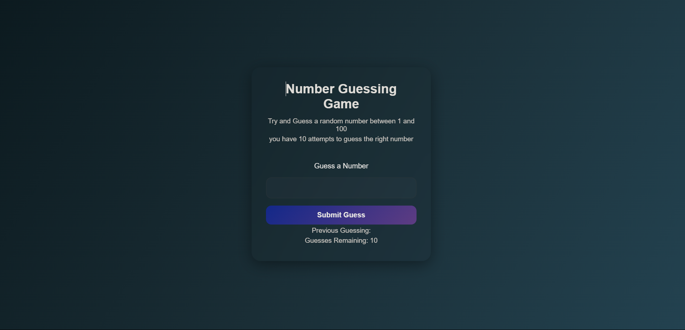

# 🎯 Number Guessing Game

## 📌 Live Demo

👉 [Click here to play the game](https://number-guessing-game-seven-theta.vercel.app/)

Welcome to the **Number Guessing Game**, a fun and interactive web-based game built with **HTML**, **CSS**, and **JavaScript**. This game challenges users to guess a randomly generated number between 1 and 100 — with only 10 attempts!

---

## 🌟 Features

- 🔢 **Random Number Generation**: Generates a random number between 1 and 100 every time a new game starts.
- 🎮 **Interactive Gameplay**: Users have 10 chances to guess the correct number.
- 🧠 **Instant Feedback**: Players receive live feedback if their guess is too high, too low, or correct.
- 🧾 **Guess Tracking**: Displays the list of previous guesses to avoid repeating numbers.
- 🕹️ **Game Over Logic**: Auto-disables input after 10 attempts or a correct guess.
- 🔄 **Restart Functionality**: Seamlessly restart the game with a single click.
- 💡 **Input Validation**: Checks for valid numeric entries within the range of 1–100.
- 🎨 **Stylish UI**: Designed with modern glassmorphism and responsive styling for mobile-first experience.
- 📱 **Mobile Optimized**: Fully responsive and works great on all screen sizes.

---

## 🖼️ Preview

  
_Modern UI with smooth animations and glow effects_

---

## 🚀 Technologies Used

| Frontend     | Description                              |
| ------------ | ---------------------------------------- |
| `HTML5`      | Structuring the web page                 |
| `CSS3`       | Styling with animations & responsiveness |
| `JavaScript` | Game logic and interactivity             |

---

## 📂 Folder Structure

## 📂 Folder Structure

```text
├── index.html         # HTML markup
├── style.css          # Custom styles and animations
├── script.js          # Game logic and DOM interactions
└── README.md          # Project documentation
```

---

## 🧠 How to Play

1. Enter your guess (number between 1–100).
2. Click on **Submit Guess**.
3. Get immediate feedback:
   - ✅ Correct
   - 🔺 Too High
   - 🔻 Too Low
4. After 10 unsuccessful attempts, the game ends.
5. Click on **Start New Game** to play again.

---

## 🔧 Setup Instructions

You can try this project locally in 3 easy steps:

```bash
git clone https://github.com/your-username/Number-Guessing-Game.git
cd Number-Guessing-Game
open index.html in your browser
```
